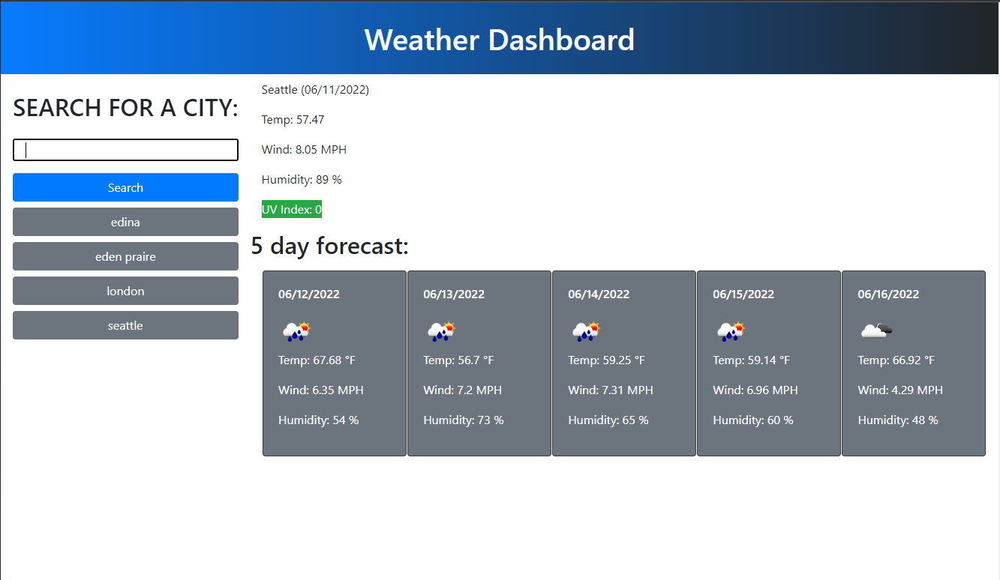

# Weather-Dashboard

## The Motivation

This challenge was a catalyst in terms of honing my skills in API's. I got to learn how to pick data from JSON and append it to the screen. Overall, this has given me hindsight to the potential of what you can truly create.

## Challenges

There were many layers to this assignment that took some time to really understand and implement. For one, getting the specific weather and date took a while to append appropriately depending on the specific day. Also, setting the icons to work was a task.

## Screenshot

## Link
https://itzguled.github.io/weather-dashboard/